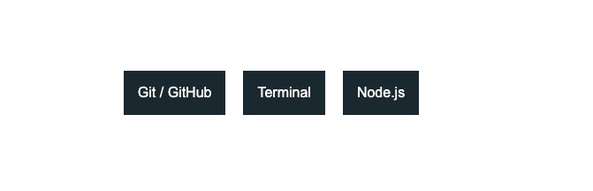
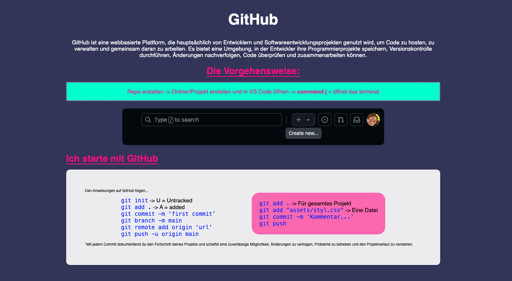

# Cheatsheet Projekt

## Übersicht

Das **Cheatsheet-Projekt** ist eine persönliche Referenz für Befehle, Anleitungen und Tipps, die in verschiedenen Entwicklungsumgebungen und Tools verwendet werden. Es ist modular aufgebaut und ermöglicht den Zugriff auf spezifische Themenbereiche wie **Git/GitHub**, **Node.js** und **Terminal** über eine übersichtliche Hauptseite.

---

## Features

### 1. Hauptseite
- Enthält Buttons mit Dropdown-Menüs, die zu verschiedenen Themenbereichen führen.
- Themenbereiche wie:
  - **Git/GitHub**
  - **Node.js**
  - **Terminal**



### 2. Detailseiten
- Die Buttons auf der Hauptseite führen zu **HTML-Seiten**, die Anleitungen und Befehle zu den jeweiligen Themen enthalten.
- Jede Seite ist speziell für ein Thema konzipiert (z. B. `nodeInstall.html` und `nodeDelete.html` für Node.js).



### 3. Tools und Stile
- **Vanilla CSS:** Einfaches Styling mit Fokus auf Klarheit und Lesbarkeit.
- **BEM-Konventionen:** Strukturierte Klassennamen für besser wartbaren CSS-Code.
- **JavaScript (optional):** Interaktive Features wie Dropdowns oder dynamische Inhalte.

---

## Projektstruktur

```plaintext
CHEATSHEET/
├── assets/
│   ├── css/
│   │   ├── main.css            # Haupt-CSS-Datei für globales Styling
│   │   ├── node.css            # CSS für Node.js-Seiten
│   │   └── terminal.css        # CSS für Terminal-Seiten (optional)
│   ├── html/
│   │   ├── git-github/
│   │   │   ├── gitCommands.html
│   │   │   └── githubTips.html
│   │   ├── Node/
│   │   │   ├── nodeInstall.html
│   │   │   └── nodeDelete.html
│   │   └── Terminal/
│   │       └── terminalCommands.html
│   ├── img/                    # Bilder und Icons für das Projekt
│   └── js/                     # Optional: JavaScript-Dateien
├── index.html                  # Hauptseite mit Buttons und Dropdowns
├── .gitignore                  # Git ignore file
└── README.md                   # Projektdokumentation
```

## Lernziele

### Modulare Struktur:
	•	Erstellung einer übersichtlichen Projektstruktur mit HTML, CSS, und JavaScript.
### Interaktive Elemente:
	•	Einsatz von Buttons und Dropdown-Menüs zur einfachen Navigation.
### Flexibles Styling:
	•	Verwendung von Vanilla CSS mit BEM-Konventionen für eine klare und wiederverwendbare Stilanwendung.
### Erweiterbarkeit:
	•	Leicht erweiterbare Struktur für zukünftige Themen und Seiten.
